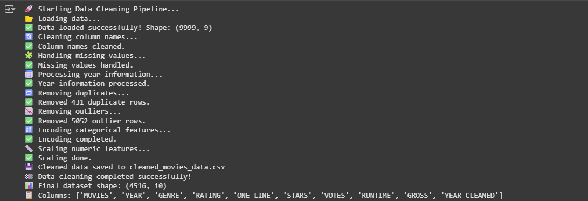

# 🎬 Movie & TV Show Data Cleaning Pipeline

A professional data preprocessing and cleaning pipeline specifically designed for movie and TV show datasets. This automated pipeline transforms raw, messy entertainment data into clean, analysis-ready datasets suitable for machine learning and data analysis.

## 📊 Project Overview

This project provides a robust data cleaning solution for entertainment industry datasets, handling common issues like missing values, outliers, inconsistent formatting, and categorical encoding. The pipeline is built with scalability and reproducibility in mind.

## 🚀 Features

- **🔍 Smart Data Loading** - Handles various data formats and encoding issues
- **🧹 Missing Value Imputation** - Intelligent handling of NaN values for both numeric and categorical columns
- **📅 Year Extraction** - Automatically extracts and cleans year information from multiple formats
- **📊 Outlier Detection** - Statistical outlier removal using Interquartile Range (IQR)
- **🔤 Categorical Encoding** - Label encoding for machine learning compatibility
- **⚖️ Feature Scaling** - Standardization of numeric features
- **🔄 Duplicate Removal** - Automatic detection and removal of duplicate entries
- **🏷️ Column Standardization** - Clean and consistent column naming conventions

## 🛠️ Installation

### Prerequisites

- Python 3.8+
- pip package manager

### Setup

1. **Clone the repository**
```bash
git clone https://github.com/AchrafElboumashouli/Data-Cleaning-Pipeline.git
cd Data-Cleaning-Pipeline
```

2. **Create virtual environment (recommended)**
```bash
python -m venv venv
source venv/bin/activate  # On Windows: venv\Scripts\activate
```

3. **Install dependencies**
```bash
pip install -r requirements.txt
```

## 📁 Project Structure

```
data-cleaning-pipeline/
│
├── data/
│   ├── raw_data.csv            # Example input data
│   └── cleaned_data.csv        # Output after cleaning
│
├── scripts/
│   └── data_cleaning.py        # Main Python script
│
├── notebooks/
│   └── demo_data_cleaning.ipynb # Optional Jupyter Notebook
│
├── requirements.txt
├── README.md
└── .gitignore

```

## 🎯 Usage

### Basic Usage

```python
from data_cleaning_pipeline import main

# Run the complete cleaning pipeline
main()
```

### Custom Usage

```python
import pandas as pd
from data_cleaning_pipeline import load_data, handle_missing_values, remove_outliers

# Load your data
df = load_data("your_movie_data.csv")

# Apply specific cleaning steps
df = handle_missing_values(df)
df = remove_outliers(df)

# Save cleaned data
df.to_csv("cleaned_data.csv", index=False)
```

### Command Line Usage

```bash
python data_cleaning_pipeline.py
```

## 📈 Data Processing Steps

The pipeline performs the following transformations:

1. **Data Loading** - Reads CSV files with proper error handling
2. **Column Cleaning** - Standardizes column names and formats
3. **Missing Value Treatment** - 
   - Numeric columns: Median imputation
   - Categorical columns: Mode imputation or 'Unknown' placeholder
4. **Year Extraction** - Parses year information from various formats
5. **Duplicate Removal** - Eliminates identical rows
6. **Outlier Detection** - Removes statistical outliers using IQR method
7. **Categorical Encoding** - Converts text categories to numerical values
8. **Feature Scaling** - Standardizes numerical features

## 📊 Output Data

The cleaned dataset includes:
- Standardized column names
- Consistent data types
- No missing values
- Properly encoded categorical variables
- Scaled numerical features
- Outlier-free distributions

## 🧪 Example

**Input (Raw Data):**
```csv
MOVIES,YEAR,RATING,VOTES,RunTime
Blood Red,-2021,6.1,"21,062",121
Rick and Morty,(2013-),9.2,"414,849",23
```

**Output (Cleaned Data):**
```csv
MOVIES,YEAR_CLEANED,RATING,VOTES,RUNTIME
Blood Red,2021,6.1,21062,121
Rick and Morty,2013,9.2,414849,23
```

## 🧪 Terminal output :



## 📄 License

This project is licensed under the MIT License - see the [LICENSE](LICENSE) file for details.

## 🐛 Troubleshooting

### Common Issues

1. **File Not Found Error**
   - Ensure the input file exists in the correct directory
   - Check file path and permissions

2. **Memory Issues**
   - Use `chunksize` parameter for large datasets
   - Consider using Dask for big data

3. **Encoding Problems**
   - Specify encoding in `pd.read_csv()` if needed
   - Use `encoding='utf-8'` or `encoding='latin-1'`

### Getting Help

- Create an issue on GitHub
- Check existing issues for solutions
- Contact the maintainers


## 🙏 Acknowledgments

- Built with pandas, numpy, and scikit-learn
- Inspired by real-world data cleaning challenges in entertainment analytics
- Thanks to the open-source community for continuous improvements

---

**⭐ Star this repo if you find it helpful!**
---
👤 Author

ACHRAF EL BOUMASHOULI 🧪⭐
